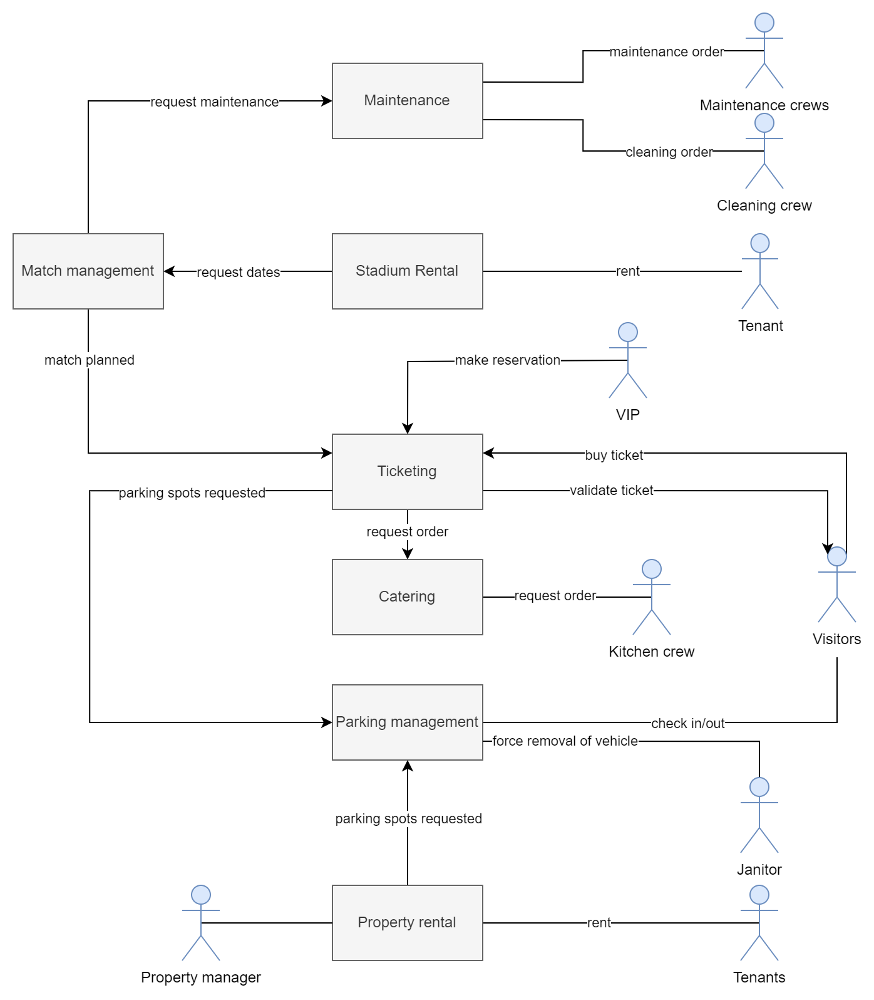

# Voetbalclub fc-smal

## Business domein

De voetbalclub FC Smal is in het bezit van het voetbalstadion van Poperinge. Dit betreft het stadion, trainingsvelden met bijhorende apparatuur, parkings, reclameborden, infrastructuur en materiaal.

Op het veld in het stadion worden matches gespeeld door de thuisploeg. Anderzijds kunnen andere ploegen of particulieren (externen) de omliggende velden, ruimtes in het stadion afhuren voor gebruik. Dit kan aan de hand van een aanvraag voor een bepaald tijdslot, gevolgd door goedkeuring van FC Smal.

Afhankelijk van welke activiteiten aan de gang zijn in het stadion moeten andere scenario's uitgevoerd worden: trainingen, matchen, events en aanwezige bedrijven.

Op de parkings moeten genoeg parkeerslots beschikbaar zijn tijdens aankomende evenementen. Zo moeten parkeerplaatsen vrijgemaakt worden, wanneer deze niet reglementair ingenomen zijn. Dit om te voorkomen dat er meer parkeerplaatsen verhuurd zijn dan beschikbaar, waardoor een actieve telling van de parkeerplaatsen door middel van slimme slagbomen noodzakelijk is.

Tijdens matchdagen moet de omgeving rond het stadion ook aangepast worden, zo moeten bepaalde straten afgezet worden. Routes voor de spelersbussen en supportersbussen doorgegeven worden, om confrontraties tussen verschillende supportersgroepen en spelers te voorkomen.

Bezoekers (visitors) van een voetbalmatch kunnen een ticket kopen voor een bepaalde match. De ticketverkoop gebeurt via het systeem van FC Smal als onze ploeg speelt, maar externen kunnen ook gebruik maken van het systeem (onder betaling). Een ticket geeft toegang tot een specifiek deel van het stadion, hierbij is het afhankelijk van welk ticket je hebt gekocht tot welk deel je toegang krijgt. Hier wordt een verschil gemaakt tussen supporters van zone A, B en dergelijke, maar ook tussen VIP en gewone supporters.

Tijdens het gebruik van het stadion worden ook van verschillende bars gebruik gemaakt. Hier is monitoring van het verbuik van dranken, etenswaren noodzakelijk, zodat deze op tijd aangevuld kunnen worden.

## Business scenarios

### Match inplannen

De voetbalbond (football association) deelt de planning van komend seizoen mee, wanneer de ploeg speelt, thuis als uitmatchen. Deze data worden ingepland, waardoor het stadion match-klaar gemaakt kan worden. 

Voor die match moeten de twee kleedkamers (bezoekers en thuisploeg) helemaal proper gemaakt worden. Dit wordt gedaan door de kuisploeg (cleaning crew) en deze wordt verwittigd wanneer er verwacht wordt de kleedkamers te kuisen.

Voor elke match moet het veld gecontroleerd worden door een verantwoordelijke van de BVBB. De controleur geeft mee welke onderhouden nog gedaan moeten worden voordat de match kan starten. Hierbij worden interne ploegen aangesproken afhankelijk van het controle verslag van de BVBB.

- Het gras moet afgereden zijn tot een vooraf opgelegde hoogte. Afhankelijk van de weersomstandigheden komen hier bijkomend nog taken bij. Bij vriestemperaturen moet het veld verwarmd worden om ijsplekken te voorkomen, bij lange droogtes moet het veld extra bijgesproeid worden. Hierbij wordt het team verantwoordelijk voor de conditie van het gras aangesproken.
- Doellijn technologie en VAR moet aanwezig zijn, wanneer deze niet aanwezig zijn moet een aanvraag gedaan worden bij de BVBB om deze technologiën te lenen.
- De lijnen moeten zichtbaar genoeg zijn, anders moeten deze opnieuw getrokken worden. Dit wordt gedaan door de lijntrekkers.

~~Afhankelijk van de rivaliteit tussen de ploegen moet extra politie ingeschakeld worden, meerdere wegen afgesloten worden om supporters groepen van elkaar te scheiden.~~ 

> Dit heeft niet echt betrekking tot ons systeem volgens mij, misschien beter achterwege laten -martijn

### Stadion verhuren

De verhuur (property rental) van het stadion gebeurt altijd via de website van FC Slam, die het stadion beheert. Hierbij worden aan huurders (tenants) vrije datums en tijdsslots getoond waar zij een aanvraag voor kunnen doen.

Afhankelijk van het type verhuur moeten ook parkeerplaatsen gereserveerd worden. De lijst van toegelaten nummerplaten en/of het aantal gereserveerde parkeerplaatsen worden bij de aanvraag meegegeven door de huurder. Hierbij moet de parkeerwachter controleren dat desbetreffende auto's gebruik mogen maken van de parking, dit automatisch door nummerplaatherkenning of op controle van toegangsticket. Het ticket wordt nagekeken op geldigheid. 

Het verhuren van het stadion kan gebeuren door externe partijen zoals bv. bedrijven, scholen, studentenverinigingen ... De prijsbepaling is afhankelijk van welke infrastructuur er wordt gehuurd (bv. veld, cafetaria, zalen, ...) en de tijdsduur. Het is onafhankelijk van de capaciteit, die wel wordt aangegeven op basis van de gekozen te huren infrastructuur.

### Ticketverkoop (ToDo, waar is er interactie met het systeem? Kunnen ze overal binnen, waar wordt dat gecontrolleerd... )

> alvorens diep op de verschillende niveaus in te gaan zou ik gewoon uitleggen dat mensen een ticket kunnen kopen en dat ze dan inchecken op de dag van de match. Dat is de belangrijkste functionaliteit - martijn

Supporters kunnen op 3 manieren betalen om een match te kunnen bekijken.

1. Eén maand voor de match opent de ticketverkoop. Als deze geopend is kunnen supporters van de thuisploeg of van de bezoekers een plekje reserveren voor zichzelf of voor meerdere personen (max. 5). Er zijn verschillende levels van tickets. Je hebt de gewone stoeltjes, waarvan de prijs stijgt des te beter de plaatsen. Maar er zijn ook de VIP boxes die supporters kunnen huren. Bij de VIP boxes kan een maaltijd genomen worden.
2. Trouwe supporters van FC Smal kunnen in het begin van het seizoen een abonnement kopen, dit geeft hen toegang tot alle matches met zekerheid van plekken tussen andere abonnementen houders. Dit abonnement kan je in een keer afbetalen maar kan ook een maandelijkse storting zijn. Het is goedkoper wanneer het direct betaald wordt.
3. Supporters hebben ook de mogelijkheid om lid te worden van de fanclub. Hiervoor betaalt men een maandelijkse prijs (wel stukken lager dan het abonnement). Wanneer een supporter lid is van de fanclub krijgt die eerder toegang tot tickets en aan een lagere prijs voor betere zitjes.

### Gebruik van de parking

De parking is toegankelijk voor iedereen, maar is opgedeeld in verschillende zones of gradaties. In aflopende volgorde van duurste naar goedkoper: gewone bezoekers (winkel, stadion ...), bezoekers voor de lokale bedrijven/organisaties en speciale parkings voor abonnees van het voetbal.

Afhankelijk van de planning geeft het systeem door welke parkings afgesloten moeten worden.  Deze kunnen afgehuurd zijn, om veiligheidsredenen en dergelijke. Het aantal ingenomen parkeerplaatsen wordt bijgehouden. Het is mogelijk dat er te veel auto's nog zijn geparkeerd, zonder dat deze daar allemaal toelating voor hebben. Bijvoorbeeld auto's van winkeliers die nog steeds geparkeerd staan, auto's van supporters die door overmacht blijven staan, ... In dergelijke gevallen wordt de parkeerwachter gecontacteerd om desbetreffende auto's te laten verwijderen van het domein. De parkeerwachter kan nagaan welke auto's wel of niet geparkeerd mogen zijn.

Er is natuurlijk ook parking voor de spelers, leveranciers  en externen (bv. onderhoudsteam) ... maar deze parking is gratis. Leverancies moeten laten weten wanneer deze gebruik gaan maken van de parkeerplaats, zodat deze niet dubbel geboekt kan worden. Hierdoor kunnen genoeg parkeerplaatsen voorzien worden bij leveringen.

Op de parking staan verschillende automaten waar er een parkeerticket kan gekocht worden, deze kunnen ook online aangevraagd worden.

Op de website kunnen oa. de abonnees hun nummerplaat ingeven waardoor er vanzelf een parkeerticket aan een lagere prijs wordt toegevoegd aan hun abonnement. Dit ticket geeft hun toegang tot een desbetreffende parking, zodat zij niet tot elke parking toegang hebben. De checks op de parking (check-in, check-out, ...) gebeuren namelijk o.b.v. nummerplaat.

Er zijn opties tot: een speciaal matchticket (als er een voetbalmatch is), een dagticket (toegang hele stadion) en een standaardticket (toegang hele stadion) o.b.v. de geparkeerde tijdsduur.

Bezoekers van de lokale winkels hoeven niet een ticket te kopen, zij kunnen gebruik maken van hun kassaticket, dat ook geldt als een geldig parkeerticket. Hiervoor moeten men voor veiligheidsredenen natuurlijk op de juiste parking staan. Als men aan de slagboom staat en men staat niet in het systeem als winkelier, worden ze verplicht een dagticket te kopen ter compensatie.

### Verhuur panden voor bedrijven/winkels

Aan het gigantische voetbalstadion van Poperinge zijn er ook panden voorzien voor handelaars en bedrijven. Een bedrijf kan een pand huren door een aanvraag in te dienen. Als wij deze goedkeuren wordt er een contract aangemaakt en betaalt het bedrijf een bepaalde waarborg.  Aan het begin van de maand wordt het verbruik van elektriciteit, gas en water van de afgelopen maand gemeten per bedrijf en wordt er een factuur opgemaakt met de som van het verbruik en de huurprijs. Deze wordt doorgestuurd naar het desbetreffende bedrijf, waarna er wordt bijgehouden of het bedrag reeds betaald is. Een bedrijf kan zijn contract ook stopzetten. Als deze stopzetting binnen de huurtermijn ligt, zal het bedrijf een aantal maanden opzeg moeten betalen, afhankelijk van de duur van het contract.

### Onderhoud stadion
> dees eeft redelijk wat overlap met de 'match inplannen', dus kweet niet egt wat we hiermee willen doen - arthur
Met elke match moet er vooraf minstens één training ingepland worden en minstens één team meeting om de tactieken te bespreken. De tijdsstippen van de match, training en meeting worden meegedeeld met de spelers, trainer, staf en de verantwoordelijke voor het onderhoud van de velden. Deze laatste moeten zorgen dat het veld tegen de match speelklaar is.

Drie uur voordat de match start kunnen supporters het machtige stadion bezoeken en in de merchandise shop iets kopen en in het café, cafetaria 'de sporthalle' bij Carlo en Melanie, iets drinken. Tegen drie uur voor de match moeten, naast het stadion in zijn geheel, dus ook de shops en de cafetaria klaarstaan.

## Service Diagram

Gemaakt met [draw.io](draw.io)

## Mogelijke uitbreidingen

Indien onze huidige business scenarios niet uitgebreid genoeg zijn hebben we hier enkele ideeën voor mogelijke uitbreidingen:

* Eten- en drankverkoop
* Verhuur van materiaal
* ...
