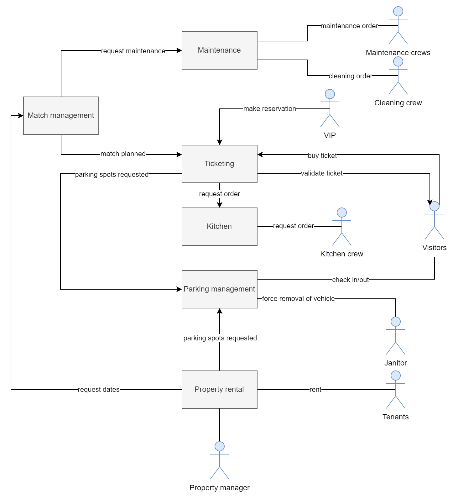

# Voetbalclub fc-smal

## Business domein

De voetbalclub FC Smal is in het bezit van het voetbalstadion van Poperinge. Dit betreft het stadion, trainingsvelden met bijhorende apparatuur, parkings, reclameborden, infrastructuur en materiaal.

Op het veld in het stadion worden matches gespeeld door de thuisploeg. Anderzijds kunnen andere ploegen of particulieren (externen) de omliggende velden en ruimtes in het stadion afhuren voor gebruik. Dit kan aan de hand van een aanvraag voor een bepaald tijdslot gevolgd door goedkeuring van FC Smal.

Afhankelijk van welke activiteiten aan de gang zijn in het stadion moeten andere scenario's uitgevoerd worden: trainingen, matchen, events en aanwezige bedrijven.

Op de parkings moeten genoeg parkeerslots beschikbaar zijn tijdens aankomende evenementen. Zo moeten parkeerplaatsen vrijgemaakt worden wanneer deze niet reglementair ingenomen zijn. Dit om te voorkomen dat er meer parkeerplaatsen verhuurd zijn dan dat er beschikbaar zijn. Hiervoor is er een actieve telling van de parkeerplaatsen door middel van slimme slagbomen.

Tijdens matchdagen moet de omgeving rond het stadion ook aangepast worden, zo moeten bepaalde straten afgezet worden. Routes voor de spelersbussen en supportersbussen moeten doorgegeven worden om confrontraties tussen verschillende supportersgroepen en spelers te voorkomen.

Bezoekers (visitors) van een voetbalmatch kunnen een ticket kopen voor een bepaalde match. De ticketverkoop gebeurt via het systeem van FC Smal als onze ploeg speelt, maar externen kunnen ook gebruik maken van het systeem (onder betaling). Een ticket geeft toegang tot een specifiek deel van het stadion, hierbij is het afhankelijk van welk ticket je hebt gekocht tot welk deel je toegang krijgt. Hier wordt een verschil gemaakt tussen supporters van zone A, B en dergelijke, maar ook tussen VIP en gewone supporters.

Tijdens het gebruik van het stadion worden ook van verschillende bars gebruik gemaakt. Hier is monitoring van het verbruik van dranken en etenswaren noodzakelijk, zodat deze op tijd aangevuld kunnen worden.

## Business scenarios

### Match inplannen

De voetbalbond (football association) deelt de matchplanning van komend seizoen mee. Deze data worden ingepland, waardoor het stadion match-klaar gemaakt kan worden.

Voor die match moeten de twee kleedkamers (bezoekers en thuisploeg) helemaal proper gemaakt worden. Dit wordt gedaan door de kuisploeg (cleaning crew) en deze wordt verwittigd wanneer er verwacht wordt de kleedkamers te kuisen.

Voor elke match moet het veld gecontroleerd worden door een verantwoordelijke van de BVBB. De controleur geeft mee welke onderhouden nog gedaan moeten worden voordat de match kan starten. Hierbij worden interne ploegen aangesproken afhankelijk van het controle verslag van de voetbalbond.

- Het gras moet afgereden zijn tot een vooraf opgelegde hoogte. Afhankelijk van de weersomstandigheden komen hier bijkomend nog taken bij. Bij vriestemperaturen moet het veld verwarmd worden om ijsplekken te voorkomen, bij lange droogtes moet het veld extra bijgesproeid worden. Hierbij wordt het team verantwoordelijk voor de conditie van het gras aangesproken.
- Doellijn technologie en VAR moet aanwezig zijn, wanneer deze niet aanwezig zijn moet een aanvraag gedaan worden bij de BVBB om deze technologiën te lenen.
- De lijnen moeten zichtbaar genoeg zijn, anders moeten deze opnieuw getrokken worden. Dit wordt gedaan door de lijntrekkers.

Afhankelijk van de rivaliteit tussen de ploegen moet extra politie ingeschakeld worden. Deze worden verwittigd om: wegen om te leiden om supportersgroepen van elkaar te scheiden; extra bemanning te voorzien; ...

<!--

- (Martijn) Dit heeft niet echt betrekking tot ons systeem volgens mij, misschien beter achterwege laten;

- (Stijn) Wel relevant, want dan wordt de politie verwittigd. Dus is de politie een extra factor, gebruik makend van het systeem.
- (Lars) ik vind dit ook wel goed, met die kuisploeg enzo.

- (Arthur) kzit nog eens te peinzen: eigenlijk moeten we hier ook rekening houden met bv. de leveranciers (eten etc.) want dit hoort ook allemaal bij het inplannen van de match;
je moet deze leveranciers allemaal contacteren om ervoor te zorgen dat hun producten tegen de matchdag bij jou liggen.
Tzelfde kan eig. ook gezegd worden over bv. de parking; je zou moeten laten weten aan de externe bedrijven/winkels dat er die dag match is; waardoor ook zij daar rekening mee kunnen houden, of zelfs op in spelen. als we spreken over 'planning', hoort dit er allemaal bij

-->

### Stadion verhuren

De verhuur (property rental) van het stadion gebeurt altijd via de website van FC Smal, die het stadion beheert. Hierbij worden aan huurders (tenants) vrije datums en tijdsslots getoond waar zij een aanvraag voor kunnen doen.

Afhankelijk van het type verhuur moeten ook parkeerplaatsen gereserveerd worden. De lijst van toegelaten nummerplaten en/of het aantal gereserveerde parkeerplaatsen worden bij de aanvraag meegegeven door de huurder. Hierbij moet de parkeerwachter controleren dat desbetreffende auto's gebruik mogen maken van de parking, dit automatisch door nummerplaatherkenning of op controle van toegangsticket. Het ticket wordt nagekeken op geldigheid.

Het verhuren van het stadion kan gebeuren door externe partijen zoals bv. bedrijven, scholen, studentenverinigingen ... De prijsbepaling is afhankelijk van welke infrastructuur er wordt gehuurd (bv. veld, cafetaria, zalen, parking, ...) en de tijdsduur. Het is onafhankelijk van de capaciteit, die wel wordt aangegeven op basis van de gekozen te huren infrastructuur.

### Ticketverkoop

<!---

(Martijn) Alvorens diep op de verschillende niveaus in te gaan zou ik gewoon uitleggen dat mensen een ticket kunnen kopen en dat ze dan inchecken op de dag van de match. Dat is de belangrijkste functionaliteit.

(Stijn) Ticketverkoop prioriteit. De gradaties kan je wel gebruiken als inkleding.
Wel heel weinig betrokken factors, uiteindelijk maar 1 interactie. Client <-> Online ticketverkoop.

Door het gebruik van VIP-tickets is het wel noodzakelijk dat er gebruik gemaakt wordt van het systeem.
- Voor hoeveel mensen moeten er gerechten voorzien worden.
  - Allergiën
  - Verzoeken
  => Mss beter als een ander scenario gebruiken.

--->

Na corona is een leeg stadion niet het beeld dat we nog willen zien. Supporters kunnen hun toegang tot het stadion verkrijgen door het kopen van een ticket. Dit kan o.b.v. een dagticket of een abonnement. Deze kunnen aangekocht worden via de website.

In de tickets en abonnementen zijn verschillende formules mogelijk. Zo hebben supporters de keuze om een standaard ticket te kopen, dat hun toegang geeft tot het bekijken van de match. Voor de meer exclusieve supporters zijn VIP-boxen beschikbaar. 

Bij de VIP-formule horen een driegangenmenu en betere stoelen om naar de match te kijken. De driegangenmenu's worden door een professionele keukenploeg voorbereid. Zij moeten op voorhand weten hoeveel gasten gebruik maken van de VIP-boxen om de nodige voedselaankopen te doen. VIP's moeten ook steeds op voorhand allergiën en het wel of niet eten van vlees doorgeven. FC Smal vraagt deze keuken om alternatieven te kunnen voorzien.

<!--
(Stijn) Dit deel zou eig. weggelaten mogen worden.

(Arthur) Tenzij we de interacties met ons systeem uitleggen: registreren als abonnee, gegevens ingeven (nummerplaat etc), abonnement dan kopen op website, ...
=> in feite kunnen we ook hier een apart scenario van maken. het kopen van een abonnement (voor de eerste keer weliswaar)

* Eén maand voor de match opent de ticketverkoop. Als deze geopend is kunnen supporters van de thuisploeg of van de bezoekers een plekje reserveren voor zichzelf of voor meerdere personen (max. 5). Er zijn verschillende levels van tickets. Je hebt de gewone stoeltjes, waarvan de prijs stijgt des te beter de plaatsen. Maar er zijn ook de VIP boxes die supporters kunnen huren. Bij de VIP boxes kan een maaltijd genomen worden.
* Trouwe supporters van FC Smal kunnen in het begin van het seizoen een abonnement kopen, dit geeft hen toegang tot alle matches met zekerheid van plekken tussen andere abonnementen houders. Dit abonnement kan je in één keer afbetalen maar kan ook een maandelijkse storting zijn. Het is goedkoper wanneer het direct betaald wordt.
* Supporters hebben ook de mogelijkheid om lid te worden van de fanclub. Hiervoor betaalt men een maandelijkse prijs (wel stukken lager dan het abonnement). Wanneer een supporter lid is van de fanclub krijgt die eerder toegang tot tickets en aan een lagere prijs voor betere zitjes. 

-->

### Gebruik van de parking

De parking is toegankelijk voor iedereen, maar is opgedeeld in verschillende zones of gradaties. In aflopende volgorde van duurste naar goedkoper: gewone bezoekers (winkel, stadion ...), bezoekers voor de lokale bedrijven/organisaties en speciale parkings voor abonnees van het voetbal.

Afhankelijk van de planning geeft het systeem door welke parkings niet toegankelijk zijn. Deze parkings kunnen afgehuurd zijn na aanvraag, of afgesloten zijn om veiligheidsredenen en dergelijke. Het aantal real-time ingenomen parkeerplaatsen wordt bijgehouden. Het is mogelijk dat er te veel auto's nog zijn geparkeerd, zonder dat deze daar allemaal toelating voor hebben. Bijvoorbeeld auto's van winkeliers die nog steeds geparkeerd staan, auto's van supporters die door overmacht blijven staan, ... In dergelijke gevallen wordt de parkeerwachter gecontacteerd om desbetreffende auto's te laten verwijderen van het domein. De parkeerwachter kan nagaan welke auto's wel of niet geparkeerd mogen zijn.

Er is natuurlijk ook parking voor de spelers, leveranciers en externen (bv. onderhoudsteam) ... maar deze parking is gratis. Leverancies moeten laten weten wanneer deze gebruik gaan maken van de parkeerplaats, zodat deze niet dubbel geboekt kan worden. Hierdoor kunnen genoeg parkeerplaatsen voorzien worden bij leveringen.

Op de parking staan verschillende automaten waar er een parkeerticket kan gekocht worden, of deze kunnen ook online aangevraagd worden.

Op de website kunnen o.a. de abonnees hun nummerplaat ingeven waardoor er vanzelf een parkeerticket aan een lagere prijs wordt toegevoegd aan hun abonnement. Dit ticket geeft hun toegang tot een desbetreffende parking, zodat zij niet tot elke parking toegang hebben. De checks op de parking (check-in, check-out, ...) gebeuren namelijk o.b.v. nummerplaat.

Er zijn opties tot: een speciaal matchticket (als er een voetbalmatch is), een dagticket (toegang hele stadion) en een standaardticket (toegang hele stadion) o.b.v. de geparkeerde tijdsduur.

Bezoekers van de lokale winkels hoeven niet een ticket te kopen, zij kunnen gebruik maken van hun kassaticket, dat ook geldt als een geldig parkeerticket. Hiervoor moet men voor veiligheidsredenen natuurlijk op de juiste parking staan. Als men aan de slagboom staat en men staat niet in het systeem als winkelier, worden ze verplicht een dagticket te kopen ter compensatie.

### Verhuur kantoorruimten voor bedrijven/winkels

Aan het onmetelijke voetbalstadion van Poperinge zijn er ook kantoorruimten voorzien voor handelaars en bedrijven. Een bedrijf kan een kantoorruimte huren door een aanvraag in te dienen. Een bedrijf doet de aanvraag naar de beschikbare kantoorruimten. Vervolgs kunnen zij een aanvraag doen naar een specifieke kantoorruimte. Deze aanvraag wordt goedgekeurd of afgekeurd door de verantwoordelijke (property manager) van Smal FC. Bij een goedkeuring stelt deze een contract op, met bijhorende waarborg. Contracten hebben een periode van minimum 1 jaar en kunnen steeds verlengd worden.

De verantwoordelijke houdt het verbruik van elk bedrijf bij en kijkt de maandelijkse betalingen na. Bij het missen van een huur wordt het desbetreffende bedrijf gecontacteerd door de verantwoordelijke en krijgt deze een waarschuwing voor achterstallige huur. Bij meerdere waarschuwingen wordt het contract ontbonden en wordt het bedrijf de kantoorruimten ontzegd.

Een bedrijf kan ook zelf zijn contract stopzetten. Hier neemt het bedrijf contact op met de verantwoordelijke, die de stopzetting verder afrondt. Het bedrijf zal een aantal maanden opzeg moeten betalen, afhankelijk van de duur van het contract.

Jaarlijks neemt de verantwoordelijke contact op met de hurende bedrijven, met de vraag of hun contract met een jaar verlengd wordt of niet. Wanneer een bedrijf zijn contract niet wenst te verlengen, brengt dit geen bijkomende kosten met zich mee.

<!--

### ~~Onderhoud stadion~~

(Arthur) Dees eeft redelijk wat overlap met de 'match inplannen', dus kweet niet egt wat we hiermee willen doen

Met elke match moet er vooraf minstens één training ingepland worden en minstens één team meeting om de tactieken te bespreken. De tijdsstippen van de match, training en meeting worden meegedeeld met de spelers, trainer, staf en de verantwoordelijke voor het onderhoud van de velden. Deze laatste moeten zorgen dat het veld tegen de match speelklaar is.

(Stijn) Ja klopt, ik zou het eerder weglaten dan.

-->

<!--Drie uur voordat de match start kunnen supporters het machtige stadion bezoeken en in de merchandise shop iets kopen en in het café, cafetaria 'de sporthalle' bij Carlo en Melanie, iets drinken. Tegen drie uur voor de match moeten, naast het stadion in zijn geheel, dus ook de shops en de cafetaria klaarstaan. -->

## Service Diagram

Gemaakt met [draw.io](draw.io)

<!--

(Stijn) Nog toe te voegen:

    - VIP-boxen: keukencrew die moeten weten voor hoeveel mensen ze gerechten moeten voorzien en welke allergiën of vegitariërs er zijn.

- Bij het verhuur van kantoorruimtes, moet daar ook geen verantwoordelijke van FC Smal  rechtstreeks verbonden zijn daarmee? (Allez ben luidop aan het denken nu, ik kan echt totaal fout zijn. :'(  )

(Arthur) Kben nu ff aant denken hé, stel da we het scenario 'abonnement kopen (als nieuw lid)' erbij pakken, dan krijgen we een héél registratieproces erbij (!)

-->

## Mogelijke uitbreidingen

Indien onze huidige business scenarios niet uitgebreid genoeg zijn hebben we hier enkele ideeën voor mogelijke uitbreidingen:

* Eten- en drankverkoop
* Verhuur van materiaal
* ...
